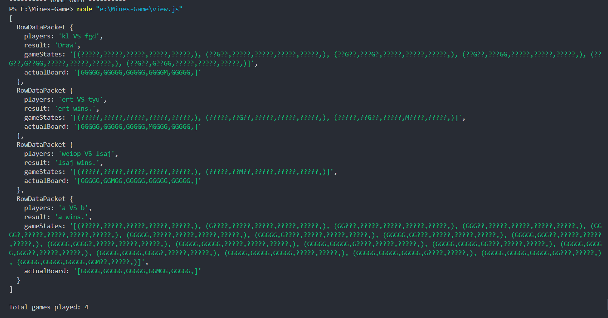

# Mines Game

This is a turn-based game of mines built using Node.js. In this game, two players compete against each other to open as many tiles as they can before opening a mine. The game adheres to the following requirements:

## Game Requirements

1. **Grid Size**: The game board consists of a 5x5 grid of tiles, totaling 25 tiles.
2. **Tiles Contents**: There are 24 tiles containing gems and 1 tile containing a mine. The mine is randomly generated each time a new game starts.
3. **Players**: Two players are required to play the game.
4. **Turn-based Gameplay**: Each player gets to open one tile per turn.
5. **End of Game**: The game can end in two ways:
   - **Win/Loss**: One of the players opens a mine and loses, automatically making the other player the winner.
   - **Draw**: Both players open 12 tiles each without hitting a mine, leaving the last tile unturned, which is the mine.
6. **Print State**: The state of the grid is printed after each turn in the form of a matrix in the terminal.
7. **Database Integration**: The game information, player information, game states, and results are stored in a database.

## How to Run the Game

To run the Mine Game, follow these steps:

1. Clone the repository or download the zip file from github using the submitted link.
2. Open the folder (Mines-Game) in the terminal.
3. Make sure you have Node.js installed on your system.
4. Install the required dependencies by running `npm install` in the terminal.
5. Ensure that you have MySQL set up and running on your local machine.
6. Update the MySQL connection details (host, user, password, database) in the codes (of all .js files) as needed.
7. Firstly, create a database (minesDB) by running 'CreateDB.js' in the terminal: `node CreateDB.js`
8. Then create a table (gameStats) by running 'CreateTable.js' in the terminal: `node CreateTable.js`
9. Run the game using `node mines.js` in the terminal.
10. To view the game history, run 'view.js': `node view.js`

## Gameplay

- Players take turns opening tiles by entering the coordinates of the desired tile.
- The game continues until one player opens a mine or both players have opened 12 tiles each without hitting a mine.
- After each turn, the state of the grid is printed in the terminal. There are three types of elements in the grid: '?' indicates unopened tile, 'G' indicates a Gem and 'M' indicates a Mine.
- Once the game ends, the result is displayed, and the game information is stored in the database.
- A sample gameplay is shown in below images:

....

- Sample history of games is shown below:

## Files

- **mines.js**: Contains the JavaScript code for the Mine Game.
- **CreateDB.js**: Contains the JavaScript code for creating the database (minesDB) in mysql.
- **CreateTable.js**: Contains the JavaScript code for creating the Table (gameStats).
- **view.js**: Contains the JavaScript code for viewing the game history.
- **README.md**: This file, providing information about the game and instructions for running it.

## Dependencies

- **prompt-sync**: Used for taking user input. Install by running `npm install prompt-sync` in the terminal.
- **mysql**: Used for making SQL connections and interacting with the database. Install by running `npm install mysql` in the terminal.

## Note

- Ensure that the MySQL database is properly set up with the required tables and configurations before running the game.
- Modify the MySQL connection details in the code to match your database configuration.

